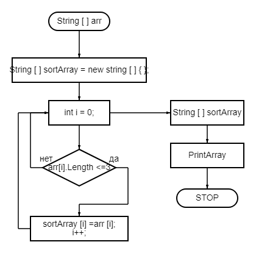

## *Контрольная работа*

1. Создать репозиторий на __*GitHub*__
2. Нарисовать блок-схему алгоритма _(можно обойтись блок-схемой основной содержательной части, если вы выделяете её в отдельный метод)_
3. Снабдить репозиторий оформленным текстовым описанием решения *(файл __README.md__)*
4. Написать программу, решающую поставленную задачу
5. Использовать контроль версий в работе над этим небольшим проектом _(не должно быть так, что всё залито одним коммитом, как минимум этапы 2, 3, и 4 должны быть расположены в разных коммитах)_

**Задача:**

*Написать программу, которая из имеющегося массива строк формирует новый массив из строк, длина которых меньше, либо равна 3 символам. Первоначальный массив можно ввести с клавиатуры, либо задать на старте выполнения алгоритма. При решении не рекомендуется пользоваться коллекциями, лучше обойтись исключительно массивами.*

* ### *Блок схема программы*

* ### *Данные  первоначального массива вводятся с клавиатуры.*
* ### *Создается и возвращается второй массив.*
* ### *Цикл __For__ обходит первый массив и если длина элемента первого массива  меньше или равна 3, записывает его в новый элемент результирующего массива.*
* ### *Вывод на экран результата выборки данных из введенного с клавиатуры первоначального массива по длине элемента.*